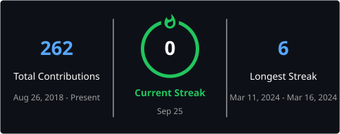

<h1 align="center">
  
</h1>

<div align="center">

[](https://git.io/typing-svg)

<br/>


<a href="https://github.com/senyu-up?tab=followers">
  
</a>

</div>

---

## 👨‍💻 About Me

```yaml
name: 森屿
github: senyu-up

focus:
  - Backend Engineering
  - Golang
  - Distributed Systems
  - Instant Messaging
  - Microservices
  - Infrastructure

principles:
  - Simple
  - Reliable
  - Scalable

status: "Still learning. Still building."
```

---

## ⚙️ Backend Stack

<div align="center">


<br/><br/>


</div>

---

## 📊 GitHub Analytics

<div align="center">





<br/>


</div>

---

---

## ⭐️ Contribution Graph

<div align="center">

<picture>
  <source
    media="(prefers-color-scheme: dark)"
    srcset="https://raw.githubusercontent.com/senyu-up/senyu-up/output/github-contribution-grid-snake-dark.svg"
  />
  <source
    media="(prefers-color-scheme: light)"
    srcset="https://raw.githubusercontent.com/senyu-up/senyu-up/output/github-contribution-grid-snake.svg"
  />
  
</picture>

</div>

---

## 🖥️ Terminal

```bash
$ whoami
senyu-up

$ cat focus.txt
Go
Backend Engineering
Distributed Systems
Instant Messaging
Infrastructure

$ cat principles.txt
simple
reliable
scalable

$ uptime
still learning && still building
```

---

## 📬 Connect

<div align="center">

<a href="https://github.com/senyu-up">
  
</a>

<br/><br/>

<sub>Code for reliability · Design for scale</sub>

</div>

<h1 align="center">
  
</h1>
